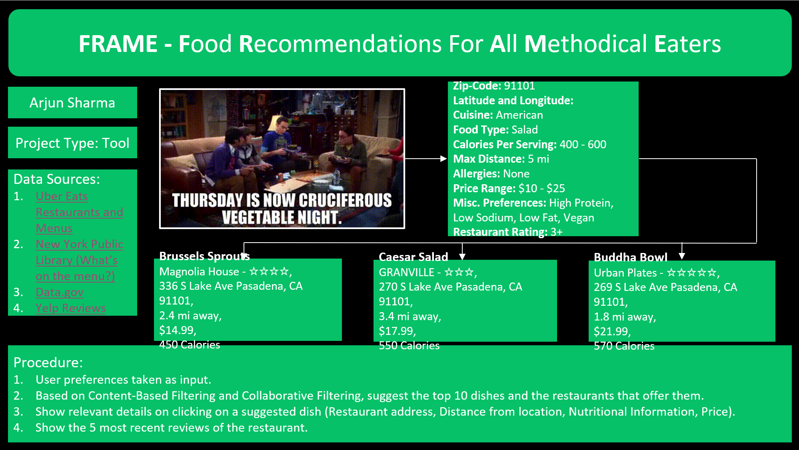

# FRAME - Food Recommendations for All Methodical Eaters
University of Washington - DATA515  
Final Project  
2/12/2023
Zachary Bowyer  
Raman SV  
Arjun Sharma  
Adithyaa Vaasen  

# SETUP
## WINDOWS
install anaconda https://www.anaconda.com/ 
conda env create --name FRAME_windows --file=environment_windows.yml
conda info --envs (See if it exists)
conda activate FRAME
python setup.py

## UNIX
pip install googlemaps folium polyline uszipcode gdown numpy pandas streamlit geocode
pip install googlemaps  
pip install folium  
pip install polyline  
pip install uszipcode  
pip install gdown  
pip install numpy  
pip install pandas  
pip install streamlit  
pip install pgeocode (Temporary?)  
python setup.py  

# Project description:
This project aims to improve on the current method of ordering foods. Currently, recommendation on the delivery apps works by ads, prior visits/orders and grouped by cuisine or price. We want to introduce a holistic approach to ordering food, inspired by our endless back and forth with friends/partners such as - “what food should we order today” , “you decide, anything works for me”. 

People tend to get overwhelmed when there is a lot of data or choices provided. Often called analysis paralysis, this is common in the current app scenario as we have multiple restaurants catering to similar needs. Further, when we don’t have a set item we want to order, we end up “doom-scrolling” on food apps. 

To help alleviate these immense wastage of valuable dinner hours and to also bring in a sense of control over the food we order, we decided to embark on this tool. 

In essence, the tool has a set of filters with pre-loaded values that helps us narrow the food we want to order based on parameters such as cuisine, dietary restrictions, price, allergens and calorific/nutritional value. The output will be a set of 5-10 dishes along with the restaurant name from where this dish was selected. For the purposes of this project, we are limiting our geographical location to Seattle and its surrounding areas.

# Project type
This project is of the predefined class type: 'Tool'. It is a tool as it helps us analyze our food choices from pre-existing data sources and acts as a customized food recommender system.

# Questions of interest
1. Is simple filtering enough? Or it is necessary to use a more involved recommender system?  Should we create user profiles and custom choices or most popular searches? 
2. Are there any open API’s that we can use for data from sources such as Uber Eats or Doordash?  
3. Are the formats of menus easily readable, or do we need to scrape text from images? This is pertinent in the case of nutritional or calorific value as this is readily available in physical dining places but often unavailable on the app menus. 
4. Will we be cross-referencing datasets or APIs? And if so, how would we avoid duplicates? For example: 
   'McDonalds' vs 'MCDONALDS' vs 'McDonald's' vs 'McDonalds Restaurant', etc.  
5. How will we address the issue of no data being available based on current filters?  
6. How complicated will it be to merge our datasets?  
7. What are the geographical restrictions for scaling up this tool? Are there different standards or datasets for varying locations?

# Goal for the project output (What is going to be produced?)  
Top 5 (maybe 10) dishes that align with the user's inputs based on preferences and filters. Further details about the dish and restaurant will be provided to the users upon selecting a specific recommendation.   

# Proposal slide: 

#References:
1 “Analysis paralysis” Wikipedia, Wikimedia Foundation, 1 Sep 2022,https://en.wikipedia.org/wiki/Analysis_paralysis (accessed Feb. 13, 2023).
2 “Doomscrolling” Wikipedia, Wikimedia Foundation, 8 Feb 2023, https://en.wikipedia.org/wiki/Doomscrolling (accessed Feb. 13, 2023).
