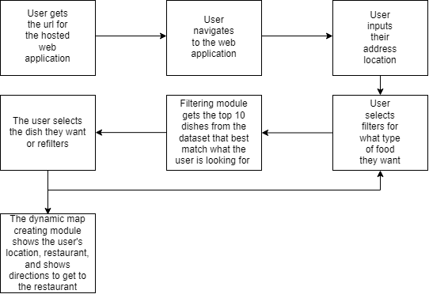

# Software components
Web-hosted application
- Reasoning: We want our tool to be publicly available through a website/url. 
- What it does: via a publicly accessible website, the app provides an interface that hosts the filters, algorithms and displays the results.  
- Inputs required: Requires a connection to the internet and port forwarding.
- Provided outputs: GUI to view visualizations, provide input, manipulate filters and display recommendations.   

Dynamic map creating module
- Reasoning: We would like to show the user their location relative to the restaurant they want to order from. We would also like to show directions to that restaurant if possible.   
- What it does: create dynamic maps based on the user's locations, provide pins for the location of the user and the restaurant or menu item, and draws polylines to represent directions from the user's location to the restaurant.  
- Inputs required: rough estimate of user location (Lat, Lon, Zip code etc.), coordinates of target restaurant(s).
- Provided outputs: JSON of directions, which are used to create a map that has pins and directions.  

Filtering module:
- Reasoning: We need to have a mechanism that can recommend dishes to users.  
- What it does: displays the top 5 items based on user inputs of their preferences and their geographical location.  
- Inputs required: User's preferences for foods encompassing filters such as allergies, dietary restrictions, proximity, nutrition, price, etc.  
- Provided outputs: visual representation of 5 dishes and the restaurants they are available at, the ratings and the location   

# Interactions to accomplish use-cases
# Use cases:
## Case: User needs recommendations on food items to have for breakfast, lunch or dinner
- For this use case, the user navigates to the website url, which is possible only if our web-hosted application is active. 
- Next, in order to display recommendations, the user must input their preferences. 
- Based on these preferences, the filtering module will determine the foods that best fit these requirements.
- For each of the food items, the location, restaurant menu and Yelp ratings (wherever available) will also be displayed by the dynamic map creating module.    

## Case: User searches for a specific restaurant to view it's entire menu  
- For this use case, the user navigates to the website url, which is possible only if our web-hosted application is active. 
- The user inputs a restaurant name in the restaurant search filter. 
- The filtering module then returns the restaurant menu data if it exists, it will display a random list of top 5 restaurants near the user otherwise.  
- When the user selects a restaurant from above, all menu data will be displayed.  
- If the user wants details about a specific item from the menu, they can select it, and the app will display the map information similar to the use case above.  

## Case: User filters for food items from a specific restaurant  
- For this use case, the user navigates to the website url, which is possible only if our web-hosted application is active.
- The user inputs the restaurant name they are looking for in the restaurant search filter. 
- The filtering module then returns the restaurant menu data if it exists, it will display a random list of top 5 restaurants near the user otherwise.  
- When the user selects their restaurant from above, all the menu data will be displayed.  
- In order to choose a particular food item, the user can input their recommednations via the input filters. 
- For the food items selected, the location, restaurant menu and Yelp ratings (wherever available) will be displayed by the dynamic map creating module.    

## Case: User wants a place on the internet to get multiple food recommendations based on filters that are not available with existing platforms  
This is an implicit use case, and is already described from the three use-cases above.

# Preliminary plan
Week 1:
- Ideate the tool
- Identify, Collect and clean data from relevant sources.
- Explore and analyze the data to identify any patterns or trends.
- Develop and test the filtering system to narrow down food choices based on user preferences.
- Success of Week 1: Have the data in hand and define all expectations

Week 2:
- Implement the recommendation algorithm to suggest 5 food items based on the user's selections.
- Create a prototype of the web-accessible application using Streamlit.
- Develop and test the functionality for displaying restaurant links and maps.
- Success of Week 2: Successful recommendation algorithm and a wireframe of the frontend

Week 3:
- Refine and optimize the recommendation algorithm for better accuracy and performance.
- Improve the user interface and add visualizations to make the app more appealing and user-friendly.
- Test the application with a small group of beta users to get feedback and make necessary adjustments.
- Success of Week 3: Improvised frontend, smooth running application without any bugs

Week 4:
- Finalize the application and deploy it to a web server for public use.
- Conduct final testing and debugging to ensure the app is running smoothly and efficiently.
- Prepare a report and a demo video to showcase the project and its features.
- Success of Week 4: Completion of end to end project
